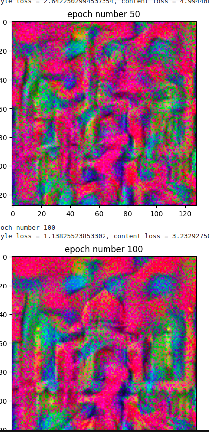

# Neural Style Transfer with PyTorch

Welcome to the Neural Style Transfer project! This repository showcases a PyTorch-based implementation of Neural Style Transfer (NST), a technique that blends the content of one image with the artistic style of another. 

## Overview

Neural Style Transfer is a deep learning technique that utilizes convolutional neural networks to separate and recombine content and style. By optimizing an objective function that balances content and style losses, we can generate images that reflect the style of famous artworks while preserving the original content.

## Technologies

- **PyTorch:** The deep learning framework used for model implementation and training.
- **Convolutional Neural Networks (CNNs):** Used to extract and blend content and style features from images.
- **Optimization Algorithms:** Employed to minimize the loss functions and generate the final stylized image.

## How It Works

1. **Content Extraction:** Extract features from the content image using a pre-trained CNN.
2. **Style Extraction:** Extract style features from the style image.
3. **Image Generation:** Combine content and style features to generate a new image that merges both elements.
4. **Optimization:** Use gradient descent to adjust the generated image to minimize content and style loss.

## Uses

- **Artistic Creation:** Transform personal photos into artistic pieces inspired by famous styles.
- **Design & Media:** Enhance creative projects with unique visual effects.
- **Educational Tool:** Understand and experiment with advanced deep learning techniques.

## Advancements

- **Improved Performance:** Latest models offer enhanced quality and faster processing times.
- **Customization:** Fine-tune style and content weights for more control over the artistic output.
- **Real-time Processing:** Recent advancements enable near-real-time style transfer applications.

## Examples

Here are some examples of the stylized images generated by our model:





## Getting Started

To use this project, clone the repository and follow the instructions in the `setup.md` file to install dependencies and run the model.

```bash
git clone https://github.com/yourusername/your-repo.git
cd your-repo
```

## License

This project is licensed under the MIT License. See the LICENSE file for details.
